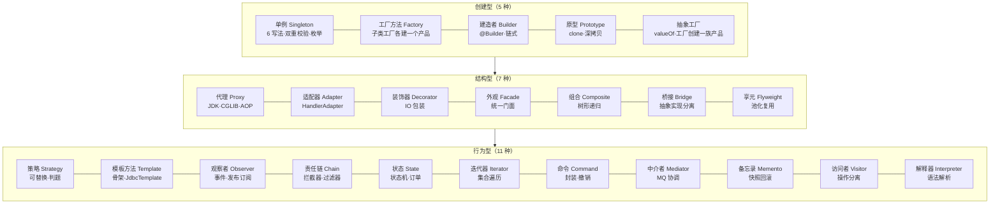
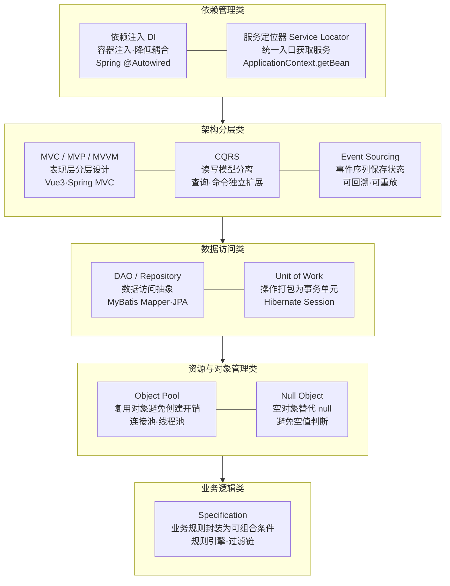

```mermaid
flowchart TB
    subgraph 创建型["创建型（5 种）"]
        direction LR
        P1["单例 Singleton<br/>6 写法·双重校验·枚举"] --- P2["工厂方法 Factory<br/>子类工厂各建一个产品"] --- P3["建造者 Builder<br/>@Builder·链式"] --- P4["原型 Prototype<br/>clone·深拷贝"] --- P5["抽象工厂<br/>valueOf·工厂创建一族产品"]
    end

    subgraph 结构型["结构型（7 种）"]
        direction LR
        S1["代理 Proxy<br/>JDK·CGLIB·AOP"] --- S2["适配器 Adapter<br/>HandlerAdapter"] --- S3["装饰器 Decorator<br/>IO 包装"] --- S4["外观 Facade<br/>统一门面"] --- S5["组合 Composite<br/>树形递归"] --- S6["桥接 Bridge<br/>抽象实现分离"] --- S7["享元 Flyweight<br/>池化复用"]
    end

    subgraph 行为型["行为型（11 种）"]
        direction LR
        B1["策略 Strategy<br/>可替换·判题"] --- B2["模板方法 Template<br/>骨架·JdbcTemplate"] --- B3["观察者 Observer<br/>事件·发布订阅"] --- B4["责任链 Chain<br/>拦截器·过滤器"] --- B5["状态 State<br/>状态机·订单"] --- B6["迭代器 Iterator<br/>集合遍历"] --- B7["命令 Command<br/>封装·撤销"] --- B8["中介者 Mediator<br/>MQ 协调"] --- B9["备忘录 Memento<br/>快照回滚"] --- B10["访问者 Visitor<br/>操作分离"] --- B11["解释器 Interpreter<br/>语法解析"]
    end

    创建型 --> 结构型 --> 行为型
```

```mermaid
flowchart TB
    subgraph 依赖管理["依赖管理类"]
        direction LR
        D1["依赖注入 DI<br/>容器注入·降低耦合<br/>Spring @Autowired"] --- D2["服务定位器 Service Locator<br/>统一入口获取服务<br/>ApplicationContext.getBean"]
    end

    subgraph 架构分层["架构分层类"]
        direction LR
        A1["MVC / MVP / MVVM<br/>表现层分层设计<br/>Vue3·Spring MVC"] --- A2["CQRS<br/>读写模型分离<br/>查询·命令独立扩展"] --- A3["Event Sourcing<br/>事件序列保存状态<br/>可回溯·可重放"]
    end

    subgraph 数据访问["数据访问类"]
        direction LR
        R1["DAO / Repository<br/>数据访问抽象<br/>MyBatis Mapper·JPA"] --- R2["Unit of Work<br/>操作打包为事务单元<br/>Hibernate Session"]
    end

    subgraph 资源与对象["资源与对象管理类"]
        direction LR
        O1["Object Pool<br/>复用对象避免创建开销<br/>连接池·线程池"] --- O2["Null Object<br/>空对象替代 null<br/>避免空值判断"]
    end

    subgraph 业务逻辑["业务逻辑类"]
        direction LR
        B1["Specification<br/>业务规则封装为可组合条件<br/>规则引擎·过滤链"]
    end

    依赖管理 --> 架构分层 --> 数据访问 --> 资源与对象 --> 业务逻辑
```

